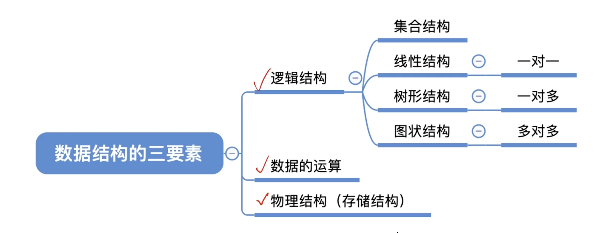
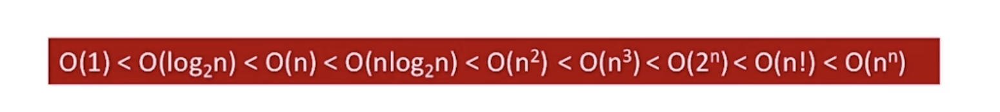

==========================================
绪论
==========================================

数据结构的基本概念
==========================================

------------------------------------------
什么是数据
------------------------------------------
数据是 :red:`信息的载体` ，是描述客观事物属性的数、字符及所有能输入到计算中，并 :red:`被计算机程序识别和处理` 
的符号的集合，数据是计算机程序加工的原料。 

:red:`数据元素`，通过作为一个整体进行考虑和处理。

一个数据元素可以由若干:red:`数据项组成`，数据项是构成数据元素的不可分割的最小单位

数据对象是具有 :red:`相同性质`的数据元素的集合，是数据的一个子集。

数据结构是相互之间存在一种或多种特定:red:`关系`的数据元素的集合

------------------------------------------
数据的三要素
------------------------------------------

- 集合结构： 数据元素是无关系的
- 线性结构： 数据元素是一对一的关系。
- 树形结构： 数据元素是一对多的关系。 
- 图结构： 数据元素是多对多的关系

------------------------------------------
数据的运算
------------------------------------------
针对某种逻辑结构，结合实际需求，定义:red:`基本运算`

------------------------------------------
物理结构
------------------------------------------
数据的物理结构就是存储结构，就是如何用计算机表示数据的逻辑关系

- 顺序存储： 逻辑顺序相邻的元素存储在物理上相邻位置。
- 链式存储： 逻辑上相邻的元素在存储物理上可以不相邻。
- 索引存储： 存储元素信息的基础上，额外建立附加的索引表。
- 散列存储： 根据元素的关键字直接计算出该元素的存储地址。 

若采用顺序存储，各个元素在物理上必须是连续的， 若采用非顺序存储，在物理上是可以离线的。 

数据的存储结构会影响分配的方便程度和对数据的运算速度。 
  
------------------------------------------
数据类型
------------------------------------------
数据类型是一个*值的集合*和定义在此集合上的*一组操作*的总称。

- 原子类型
- 结构类型

抽象数据类型ADT是抽象数据*组织*及与之相关的*操作*。

算法
==========================================

------------------------------------------
什么是算法
------------------------------------------

`程序 = 程序数据 + 算法`

算法是对特定问题求解:red:`步骤的一种描述`，它是指令的有序序列，其中每条指令表示一个或多个操作。 

------------------------------------------
算法的特性
------------------------------------------

- 有穷性： 一个算法必须总在执行*有穷步数*之后结束，每一步*有穷时间*内完成。 
- 确定性： 算法指令明确，*相同的输入*只能得到*相同的输出*。
- 可行性： 算法描述的操作，都可以通过已经实现的基本预算执行有限次。
- 输入： 一个算法有`>=0`个输入，
- 输出： `>=1`个输出。

------------------------------------------
好算法的特质
------------------------------------------

- 正确性： 正确无误的
- 可读性： 帮助人理解
- 健壮性： 非法数据，能正确处理，不会产生莫名其妙的输出结果
- 高效率： 时间少
- 低存储： 存储占用少

------------------------------------------
算法效率的度量
------------------------------------------

如何评估算法时间开销
------------------------------------------

- 事后统计：
- 事前预估： 时间开销Tn与问题规模n的关系

常见复杂度对比

`尝对蜜汁鸡`

- 最坏时间复杂度： 最坏情况下，算法的时间复杂度。 
- 平均时间复杂度： 所有输入均等概率的情况下，算法期望运行时间。 

如何评估算法空间开销
------------------------------------------
空间开销与问题规模n的关系。

